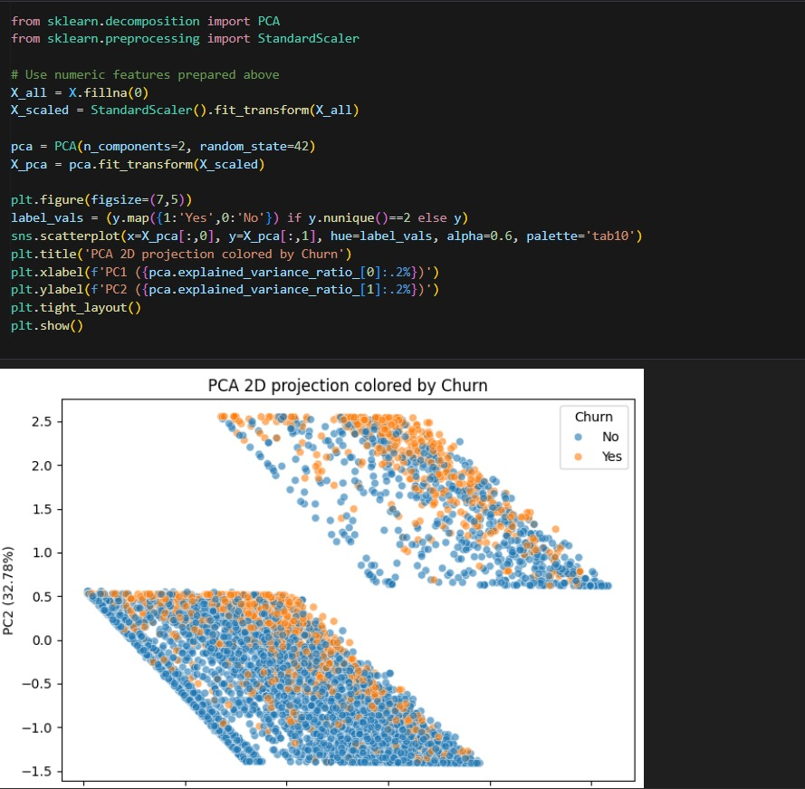
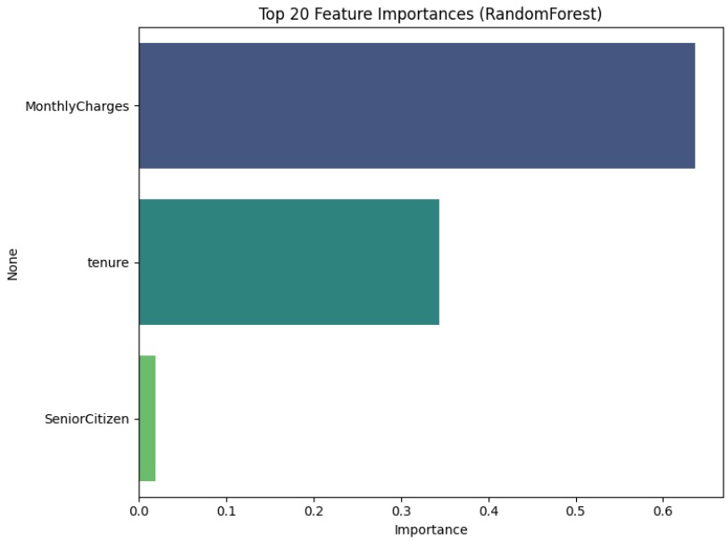
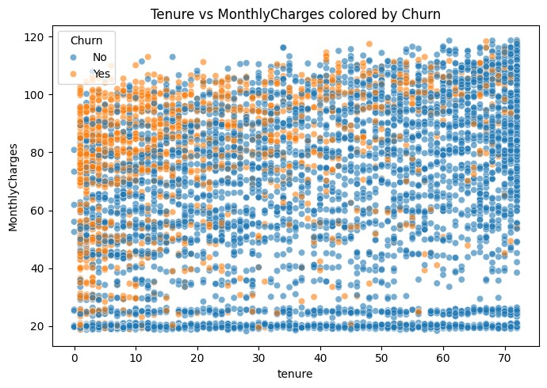

# 📌 **Customer Churn Analysis & Prediction — Project Description**

This project focuses on analyzing customer behavior and predicting churn using machine learning techniques. The goal is to help businesses understand why customers leave and proactively take actions to retain them. The dataset contains customer demographics, service usage patterns, contract details, and billing information.

---

## 🚀 **Project Objectives**

* Understand key factors influencing customer churn
* Perform data preprocessing:

  * Handling missing values
  * Encoding categorical attributes
  * Feature selection
  * Train-test split
* Train multiple machine learning models
* Compare and select the best-performing model
* Evaluate the model using industry-standard metrics
* Build a prediction-ready pipeline

---

## 🧹 **1. Data Preprocessing**

* Cleaned and standardized the dataset
* Removed inconsistencies, blank values, and duplicates
* Converted categorical variables using One-Hot Encoding
* Scaled numerical features for uniformity
* Ensured the dataset was model-friendly

---

## 🔍 **2. Exploratory Data Analysis (EDA)**

* Visualized churn distribution
* Identified important features such as:

  * Contract type
  * Monthly charges
  * Tenure
  * Internet service type
* Studied correlations and patterns influencing churn

---

## 🔧 **3. Model Training & Selection**

Tested multiple ML algorithms:

* Logistic Regression
* Decision Tree
* Random Forest
* Gradient Boosting (HistGradientBoostingClassifier)

Performed 5-fold Stratified Cross-Validation to compare models using:

* Accuracy
* Precision
* Recall
* F1-Score
* ROC-AUC

A complete ML pipeline was created to automate preprocessing + model steps.

---

## 📈 **4. Model Evaluation**

Evaluated the final selected model on the test dataset:

* Accuracy score
* Precision, Recall, and F1-Score
* ROC-AUC curve and score
* Confusion Matrix Analysis

These metrics help understand how effectively the model differentiates churners from non-churners.

---

## 🎯 **5. Final Outcome**

The project delivers:

* A trained machine learning model
* Insights on the most important churn-driving factors
* A reproducible pipeline for future predictions
* Clean and readable Jupyter Notebook / Python script

---

## 🛠 **Technologies Used**

* Python
* Pandas, NumPy
* Scikit-Learn
* Matplotlib, Seaborn
* Jupyter Notebook

---

## 📂 **Use Cases**

* Telecom companies predicting customer loss
* Subscription-based service retention
* Customer segmentation
* Business strategy improvement

---

# ⭐ **Conclusion**

This project provides a practical, end-to-end implementation of customer churn prediction using modern data science techniques. It demonstrates skills in data preprocessing, feature engineering, model building, evaluation, and documentation.

---

